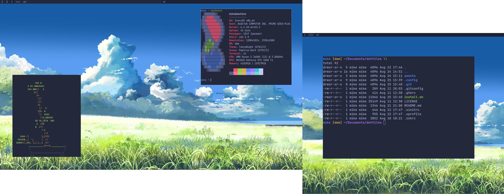
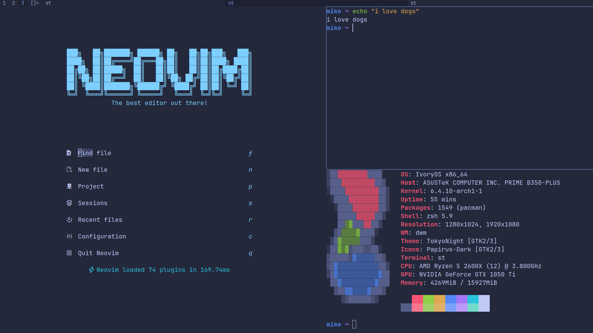
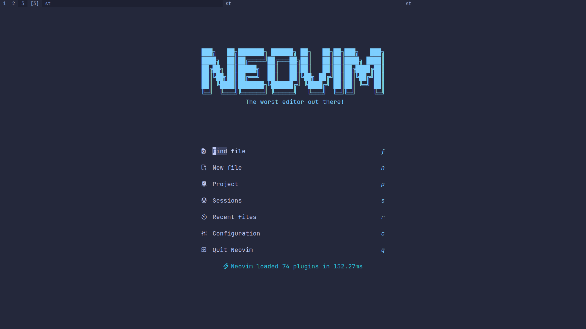
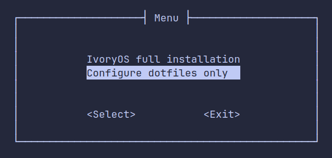

# dotfiles






## Installation for preinstalled machines
```
git clone -b dwm https://github.com/piotr-marendowski/dotfiles.git
./dotfiles/install.sh
```

## Troubleshooting
If installation of paru will be stuck on <code>Arming ConditionNeedsUpdate</code> then reboot the system and start installation again.

### Tree
<pre>
/
├── .config
│   ├── dmenu
│   ├── dwm
│   ├── MangoHud
│   ├── nvim
│   │   ├── README and init.lua
│   │   └── lua
│   │       ├── plugins
│   │       └── options
│   ├── scripts
│   └── st
├── .gitconfig
├── .xprofile - startup apps
└── .zshrc
</pre>

## Used programs/packages
- [xorg](https://wiki.archlinux.org/title/Xorg)
- [xorg-xinit](https://wiki.archlinux.org/title/Xinit)
- [dwm](https://dwm.suckless.org/)
- [zsh](https://zsh.sourceforge.io/)
- [st](https://st.suckless.org/)
- [ly](https://github.com/fairyglade/ly)
- [paru](https://github.com/Morganamilo/paru)
- [nvidia drivers](https://www.nvidia.com/en-us/drivers/unix/)
- [dmenu](https://tools.suckless.org/dmenu/)
- [pipewire](https://pipewire.org)
- [neovim](https://neovim.io/)
- [librewolf](https://librewolf.net/)
- [ranger](https://ranger.github.io/)
- [flameshot](https://flameshot.org/)

### This branch is updated and focused on integration with the [IvoryOS](https://github.com/piotr-marendowski/ivoryos), while the [qtile branch](https://github.com/piotr-marendowski/dotfiles) is more customizable and good-looking version.
